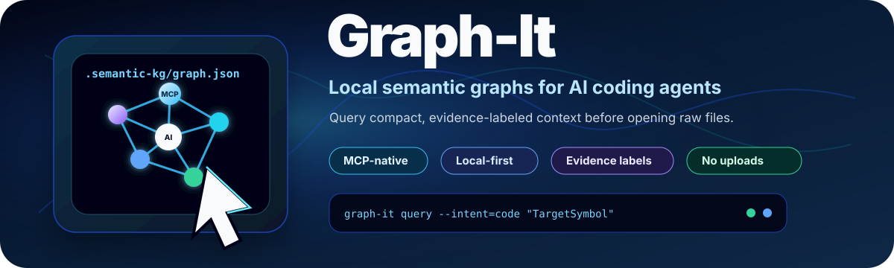

<p align="center">
  
</p>

<p align="center">
  <strong>Enterprise-first local knowledge graphs for AI coding agents.</strong><br>
  Query compact evidence-labeled project context before opening raw source files.
</p>

<p align="center">
  <a href="https://github.com/sachinjain16/graph-it/actions/workflows/ci.yml"></a>
  
  
  
</p>

# Graph-It

**Graph-It** is an enterprise-first, local-first semantic knowledge graph for **AI coding agents**. It gives Copilot CLI, Claude Code, Cursor, Codex, Clawpilot, and other MCP-capable agents a compact project map before they open raw source files.

The core idea is simple: **query the graph first, then read only the files and line ranges that matter.** Graph-It reduces context waste while keeping source, documents, media metadata, and generated graph artifacts local by default.

## Why teams use it

- **Agent-native context**: exposes graph query, path, node, neighborhood, delta, export, proof, and config tools through MCP stdio.
- **Enterprise trust boundary**: no uploads or external model calls by default; generated artifacts stay under ignored local folders.
- **Evidence-labeled graph**: every edge is marked `EXTRACTED`, `INFERRED`, or `AMBIGUOUS`.
- **Repo-local install**: bootstrap any repo with safe defaults, npm scripts, `.semantic-kg/` ignore rules, optional build, and optional git hook.
- **Useful beyond one assistant**: generate instruction packs for generic agents, Copilot CLI, Claude Code, Cursor, and Codex.
- **Proof before adoption**: write local proof packs showing graph quality, representative query hits, and a local context-size comparison.

## At a glance

| Need | Graph-It answer |
|---|---|
| Stop agents from reading half the repo | Query `.semantic-kg/graph.json` first, then inspect targeted files/ranges. |
| Keep confidential code local | No uploads, no external model calls, ignored local artifacts by default. |
| Support multiple AI coding agents | MCP stdio tools plus generated rules for Copilot CLI, Claude Code, Cursor, Codex, and generic agents. |
| Trust but verify graph output | Evidence labels, quality score, proof packs, delta reports, and drift reports. |
| Bring it to another repo fast | `graph-it install --project ..\target-repo --build` or repo-local bootstrap. |

## Default agent rhythm

The intended loop is: refresh the graph, ask it where to look, then open only the
returned files and line ranges.

```powershell
graph-it install --project . --build
graph-it query --intent=code "<symbol or feature>"
graph-it pack --intent=code --budget=1600 "<task>"
```

## What it builds

```text
.semantic-kg/
  graph.json                 queryable local graph
  quality.md                 graph health and repair plan
  delta-report.md            current-vs-previous graph changes
  drift-report.md            docs/narrative drift checks
  freshness.json             auto-refresh freshness state
  session-start.md           dev-session kickoff prompt and guardrails
  proof/proof.md             quality + representative query proof pack
  exports/graph.graphml      GraphML export for graph tools
  exports/graph.cypher       Neo4j/Cypher import script
  exports/graph.svg          standalone SVG graph snapshot
  wiki/                      agent-readable topic/community pages
  wiki/obsidian/             Obsidian-style vault with MOCs/backlinks
  graph.html                 local interactive graph viewer
  enrichment/local-extract/  optional local text sidecars

.graph-it/agent-rules/       local query-first instruction packs
worked/<name>/               optional sanitized worked-example scaffold
```

`.semantic-kg/` and `.graph-it/` are ignored by default. Review any generated artifact before sharing; graph outputs can reveal architecture, paths, symbols, and relationships.

## Quick start

Run Graph-It in this repo:

```powershell
npm run kg:build
npm run kg:auto -- --once
npm run kg:freshness
npm run kg:session-prompt -- --print
npm run kg:quality
npm run kg:query -- --intent=code "bootstrap"
npm run kg:pack -- --intent=code "bootstrap"
npm run kg:proof -- "architecture" "security privacy" "install"
npm run kg:mcp:config -- --smoke-test
```

Bootstrap another repo from this source checkout:

```powershell
node .\tools\semantic-kg.mjs bootstrap ..\target-repo --build
```

If installed as a package or from a package tarball:

```powershell
graph-it install --project ..\target-repo --build
```

Then, from the target repo:

```powershell
npm run kg:quality
npm run kg:mcp:config -- --smoke-test
```

## Commands

| Command | Purpose |
|---|---|
| `build` | Build `.semantic-kg/graph.json`. |
| `stats` | Print graph counts. |
| `query --intent=code "Symbol"` | Find code symbols/components and next-read ranges. |
| `query --intent=docs "topic"` | Find docs, sections, and architecture notes. |
| `pack --intent=code "Symbol"` | Pack ranked graph hits into live/graph/compressed/offloaded buckets before giving context to an agent. |
| `impact "Symbol"` | Find likely code/docs touchpoints. |
| `drift` | Write docs/narrative drift reports. |
| `delta` | Compare current and previous graph snapshots. |
| `quality` | Score graph trust, coverage, noise, and repair actions. |
| `auto --once` / `auto` | Refresh graph artifacts once or keep them fresh during local development. |
| `freshness` | Print current graph freshness and changed-file diff. |
| `session-prompt --print` | Generate a guarded dev-session starter prompt. |
| `proof "query"` | Write local quality/query proof artifacts. |
| `eval [--k=5] [--auto=30] [--cases=path]` | Run a local retrieval-quality evaluation (hit@1, hit@k, MRR, tokens-to-answer) as a regression guardrail. |
| `export all` | Write GraphML, Cypher, SVG, and manifest. |
| `wiki` / `obsidian` / `viewer` | Write local navigation surfaces, including an Obsidian vault. |
| `enrich --provider local --extract-text` | Create local sidecars for text-like, basic PDF, and Office ZIP/XML text. |
| `examples --name <slug> --public` | Create a sanitized worked-example scaffold for review. |
| `agent-rules all` | Generate query-first instruction packs for common agent clients. |
| `bootstrap <target>` | Install Graph-It into another repo. |
| `install --project <target>` | Package-friendly wrapper around bootstrap. |
| `mcp` | Run the MCP stdio server. |
| `mcp-config --smoke-test` | Generate MCP snippets and verify the local server. |

## AI coding agent integration

Graph-It is not tied to one assistant. Use the integration mode that fits your agent:

| Agent/client | Integration |
|---|---|
| MCP-capable clients | Run `node tools/semantic-kg.mjs mcp` and use the generated MCP config. |
| GitHub Copilot CLI | Generate `agent-rules copilot` and use Graph-It commands before broad file reads. |
| Claude Code | Generate `agent-rules claude`; optionally wire MCP if supported in your setup. |
| Cursor | Generate `agent-rules cursor` and copy the `.mdc` rule into Cursor rules. |
| Codex-style agents | Generate `agent-rules codex` / generic `AGENTS.md` style guidance. |
| Clawpilot | Use MCP config plus the Graph-It skill guidance. |

Run:

```powershell
npm run kg:agent-rules -- all
npm run kg:mcp:config -- --smoke-test
```

## MCP tools

Graph-It exposes these local tools over stdio:

- `graph.stats`
- `graph.query`
- `graph.pack`
- `graph.path`
- `graph.node`
- `graph.neighborhood`
- `graph.build`
- `graph.delta`
- `graph.freshness`
- `graph.export`
- `graph.proof`
- `graph.eval`
- `graph.mcp_config`

The server communicates over stdio only. The host agent decides what, if anything, to show outside the local session.

## Extraction model

Graph-It uses dependency-free deterministic extraction by default:

- files, hashes, sizes, extensions, summaries, and semantic tags
- Markdown/HTML headings and sections
- code symbols and likely UI components
- JS/TS imports, `require`, re-exports, and explicit exports
- local topic edges
- archive/media metadata
- optional local text sidecars for text-like files, basic embedded PDF text, and ZIP/XML `.docx`, `.pptx`, `.xlsx`

This is intentionally not a cloud RAG pipeline. Optional richer OCR, PDF, Office, AST, or model adapters should remain explicit and reviewable.

## Context Pack

Graph-It includes a lightweight, token-aware context packer. It does not proxy model
traffic or call external services. It takes ranked graph hits and returns a small
agent-ready context pack that fits a token budget:

```powershell
npm run kg:pack -- --intent=docs --budget=1600 "architecture skills memory"
```

Buckets:

| Bucket | Purpose |
|---|---|
| `live` | Current query/intent, kept uncompressed |
| `graph` | Top-ranked hits at full detail: anchors, summary, neighbors, next-read ranges |
| `compressed` | Mid-ranked hits reduced to an extractive form: signature, first summary line, first next-read, anchors |
| `offloaded` | Lower-ranked hits collapsed into a single reversible pointer; reload any of them by id with `graph.node` |

The packer fills buckets by graceful degradation so the total stays within the token
budget: it keeps the highest-ranked hits at full detail while they fit, drops the next
band to compressed form, and turns the remainder into one reversible offload pointer.
Nothing is lost — every packed item carries a `reloadWith` id.

It writes `.semantic-kg/context-pack.json` with estimated original tokens, packed
tokens, retained anchors, risk flags, and recommendations.

Token estimates come from a dependency-free approximation that is intentionally
conservative for code (identifiers and punctuation tokenize densely). They are a local
planning aid, not an exact tokenizer count.

## Token discipline

`.semantic-kg/graph.json` is the full graph and can be large. Each build stamps it with
`_approxTokens` and a `_warning`, and `graph.stats` reports `graphApproxTokens`. Agents
should never read `graph.json` whole — query it through `graph.query`, `graph.pack`,
`graph.node`, `graph.neighborhood`, or `graph.path`, then open only the suggested
next-read line ranges. Generated agent rules and the session-start prompt include this
rule.

## Evaluation

Retrieval quality is a testable property, not a vibe. `eval` scores whether a query
actually surfaces the right node near the top:

```powershell
npm run kg:eval -- --k=5 --auto=40
```

By default it auto-generates cases from the graph (query a known symbol/section, expect
that node back) so it always has a baseline with no authoring. You can also supply your
own cases file for domain-specific questions:

```powershell
npm run kg:eval -- --cases=eval/cases.json --k=5 --min-hit-rate=0.8 --strict
```

Each case is `{ "query": "...", "intent": "code|docs", "expect": { "id" | "label" | "path": "..." } }`.
It reports `hit@1`, `hit@k`, MRR, misses, and median **tokens-to-answer**, and writes
`.semantic-kg/eval-report.{json,md}`. With `--strict` it exits non-zero when `hit@k`
falls below the threshold, so it can gate CI and catch ranking regressions.

## Auto-refresh and session start

For active local development, use Graph-It as a live workspace memory layer:

```powershell
npm run kg:auto
```

For CI, scripts, or one-time refresh:

```powershell
npm run kg:auto -- --once
npm run kg:freshness
```

Auto mode tracks new, changed, removed, and likely renamed files, then refreshes local graph artifacts and writes `.semantic-kg/freshness.json`.

Generate a session-start prompt for an AI coding agent:

```powershell
npm run kg:session-prompt -- --print
```

The prompt includes guardrails for local/confidential work, freshness checks, evidence-label discipline, graph-first navigation, and validation expectations.

## Trust and privacy

Graph-It is safe by default for confidential engineering workflows:

- no network calls by default
- no external model calls by default
- `.semantic-kg/` generated artifacts are ignored
- `.graph-it/` agent-rule outputs are ignored
- every edge carries an evidence label
- enrichment is local/plan-first unless explicitly extended

See `ARCHITECTURE.md` and `SECURITY.md` for the trust boundary, artifact lifecycle, and extension rules.

## Obsidian vault export

Graph-It can turn a repo graph into a local Obsidian-style vault:

```powershell
npm run kg:obsidian
```

The vault includes:

- `Agent Start Here.md`
- `Graph-It Index.md`
- `Graph Quality.md`
- `Backlinks Index.md`
- `MOCs/` by note type and semantic topic
- rich note bodies with role summaries, source excerpts, relationship confidence, neighborhood diagrams, and agent prompts
- stable note IDs, YAML frontmatter, tags, outbound links, and backlinks
- a minimal `.obsidian` starter config

Open `.semantic-kg/wiki/obsidian/` as a local Obsidian vault. See `docs/OBSIDIAN-EXPORT.md` for details.

## Suggested npm scripts

Bootstrap adds these scripts to npm-based target repos when they are missing:

```json
{
  "scripts": {
    "kg:build": "node tools/semantic-kg.mjs build",
    "kg:stats": "node tools/semantic-kg.mjs stats",
    "kg:query": "node tools/semantic-kg.mjs query",
    "kg:impact": "node tools/semantic-kg.mjs impact",
    "kg:drift": "node tools/semantic-kg.mjs drift",
    "kg:delta": "node tools/semantic-kg.mjs delta",
    "kg:wiki": "node tools/semantic-kg.mjs wiki",
    "kg:viewer": "node tools/semantic-kg.mjs viewer",
    "kg:quality": "node tools/semantic-kg.mjs quality",
    "kg:export": "node tools/semantic-kg.mjs export",
    "kg:proof": "node tools/semantic-kg.mjs proof",
    "kg:examples": "node tools/semantic-kg.mjs examples",
    "kg:agent-rules": "node tools/semantic-kg.mjs agent-rules",
    "kg:obsidian": "node tools/semantic-kg.mjs obsidian",
    "kg:ingest": "node tools/semantic-kg.mjs ingest",
    "kg:enrich": "node tools/semantic-kg.mjs enrich",
    "kg:auto": "node tools/semantic-kg.mjs auto",
    "kg:freshness": "node tools/semantic-kg.mjs freshness",
    "kg:session-prompt": "node tools/semantic-kg.mjs session-prompt",
    "kg:watch": "node tools/semantic-kg.mjs watch",
    "kg:hook:install": "node tools/semantic-kg.mjs hook install",
    "kg:bootstrap": "node tools/semantic-kg.mjs bootstrap",
    "kg:install": "node tools/semantic-kg.mjs install",
    "kg:mcp": "node tools/semantic-kg.mjs mcp",
    "kg:mcp:config": "node tools/semantic-kg.mjs mcp-config",
    "kg:path": "node tools/semantic-kg.mjs path",
    "kg:baseline": "node tools/semantic-kg.mjs baseline",
    "kg:eval": "node tools/semantic-kg.mjs eval"
  }
}
```

## Current roadmap

The must-have enterprise foundation is in place. The next expansion areas are:

1. publish reviewed sanitized worked examples from non-confidential repos
2. add approved richer local OCR/PDF adapters
3. add optional parser-backed AST adapters when dependency policy allows
4. deepen agent-client installers beyond generated rule packs

## Skill

The reusable Graph-It skill lives in `skill/SKILL.md`. It is written as agent-agnostic guidance: use it in Clawpilot or adapt it for other AI coding assistants that support skills/instruction files.
